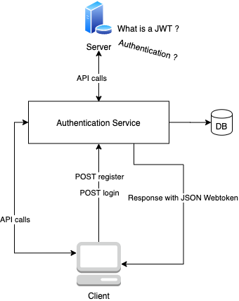

# Authentication Service - Authentication wrapper for web applications

This project is a POC of a service wrapper that implements JWT authentication in backend services without changing anything in those services. 

Status: **In Development**

## How

## TODO

* Add JWT middleware for API calls
* Create user interface
* Add DB integration
* Get mapping between user ID and API endpoint
